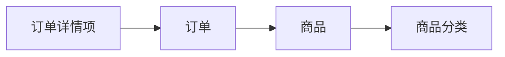
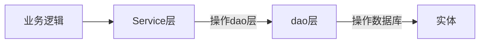
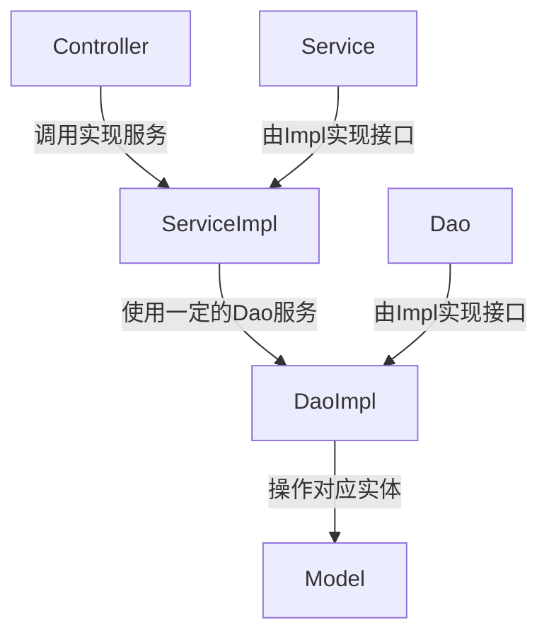

# Spring框架-控制反转与依赖注入

## 课时安排

|章节学时|课题学时|
|:--:|:--:|
|4|6|

## 课程导入（复习/预习检查）
`spring` 四大核心模块是什么?

## 教学目的与要求

掌握控制反转与依赖注入

## 教学重点

IOC控制反转,依赖注入

## 教学难点
IOC控制反转,依赖注入
## 授课方法

- 1. 讲授发
- 2. 案例教学法
- 3. 翻转课堂
- 4. 游戏教学

## 教学仪器

* 投影仪
* 计算机

## 知识点

### 控制反转诞生场景

传统面向对象开发场景

java代码实例化对象

``` java
ProductCate productCate = new ProductCate();
Product product = new Product();
Orders orders = new Orders();
OrdersItem ordersItem = new OrdersItem();
```
> 可以看出每次业务处理都要按照一定顺序创建实例化对象,这个过程繁琐,代码耦合度高
> 创建对象主要控制权在开发者手中,IOC将创建对象控制权交由Spring的IOC容器
> 借助IOC完成依赖管理

### 示例说明

场景模拟(SSH标准开发分层)


对应代码文件依赖(解耦)


示例
> `UserServiceImpl`->`UserService`->`UserDaoImpl`->
`UserDao`->`User`


### 代码片段

``` java
package com.myspring.dao;

public interface UserDao {
    public boolean login(String username, String password);
}

```

``` java
package com.myspring.dao.impl;

import com.myspring.dao.UserDao;
import org.springframework.stereotype.Component;

@Component
public class UserDaoImpl implements UserDao {
    @Override
    public boolean login(String username, String password) {
        if (username.equals("admin") && password.equals("123456")) {
            return true;
        }
        return false;
    }
}

```

``` java
package com.myspring.service;


public interface UserService  {
    public boolean login(String username, String password);
}

```

``` java
package com.myspring.service.impl;

import com.myspring.dao.UserDao;
import com.myspring.service.UserService;
import org.springframework.beans.factory.annotation.Autowired;
import org.springframework.stereotype.Component;

@Component
public class UserServiceImpl implements UserService {
    UserDao userDao;
    public UserServiceImpl(@Autowired UserDao userDao) {
        this.userDao = userDao;
    }
    @Override
    public boolean login(String username, String password) {
        return userDao.login(username, password);
    }
}

```

``` java
package com.myspring;

import com.myspring.bean.Hello;
import com.myspring.service.UserService;
import org.springframework.context.ApplicationContext;
import org.springframework.context.annotation.AnnotationConfigApplicationContext;
import org.springframework.context.annotation.ComponentScan;
import org.springframework.context.annotation.Configuration;


@Configuration
@ComponentScan
public class AppConfig {
    public static void main(String[] args) {
        ApplicationContext context = new AnnotationConfigApplicationContext(AppConfig.class);
        Hello h=  context.getBean(Hello.class);
        h.setUserName("小明");
        h.show();
        UserService userService =  context.getBean(UserService.class);
        boolean flag = userService.login("admin", "123456");
        if (flag) {
            System.out.println("登录成功");
        }else {
            System.out.println("登录失败");
        }
    }

}
```

::: warning 注意
1. java版本1.8为宜
2. 使用注解的方式可以有效减少配置文件代码量,也方便生成bean依赖图
:::